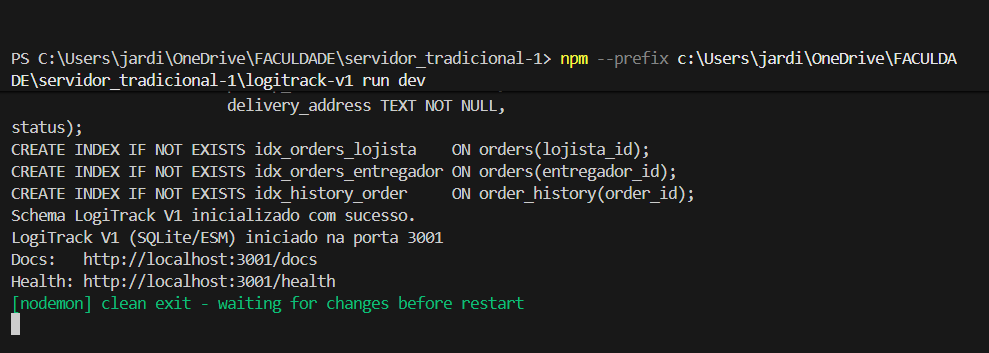
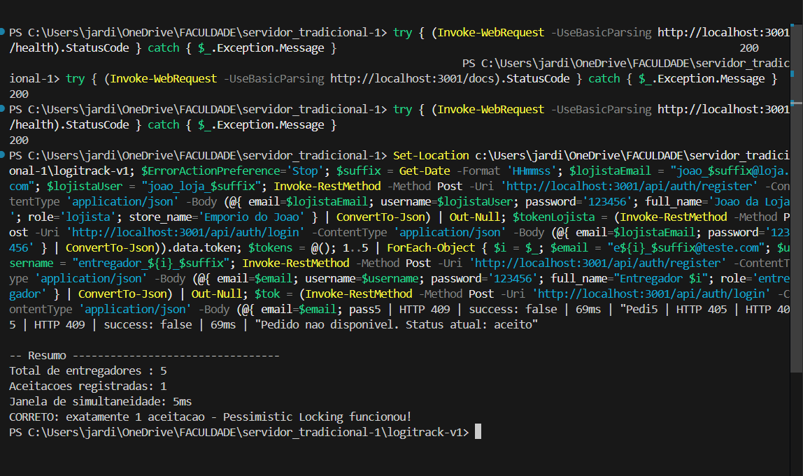
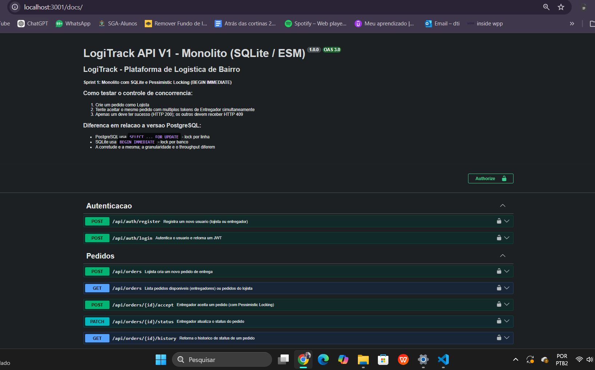

# Passo 9 - Analise e Documentacao (LogiTrack V1)

## Contexto rapido

Este documento resume o que foi validado no projeto LogiTrack V1.
A ideia foi manter tudo que o roteiro pede, mas com uma explicacao mais direta.

## 9.1 Verificacao do Swagger

Eu validei o Swagger em `http://localhost:3001/docs`.
O retorno da verificacao por terminal foi `HTTP 200`.
Conclusao: a documentacao da API esta acessivel e os endpoints aparecem na interface.

### Capturas de tela (visiveis no roteiro)

> As capturas estao na pasta `lab01-servidor-tradicional/evidencias/`.

#### Print 1 - Servidor inicializado (`npm run dev`)



#### Print 2 - Swagger aberto (`/docs`)



#### Print 3 - Teste de concorrencia



As tres capturas acima cobrem os pontos exigidos no roteiro:
- inicializacao do servidor sem erro;
- Swagger acessivel em `/docs`;
- teste de concorrencia com `Aceitacoes registradas: 1` e janela de simultaneidade.

## 9.2 Resumo das adaptacoes CJS -> ESM

| Padrao CJS | Equivalente ESM neste projeto |
|---|---|
| `require('modulo')` (pacote ESM-nativo) | `import x from 'modulo'` |
| `require('modulo')` (pacote CJS) | `createRequire(import.meta.url)('modulo')` |
| `module.exports = x` | `export default x` |
| `exports.fn = fn` | `export const fn = fn` |
| `__filename` | `fileURLToPath(import.meta.url)` |
| `__dirname` | `dirname(fileURLToPath(import.meta.url))` |
| `require('dotenv').config()` | `import 'dotenv/config'` |
| `new Worker(__filename, ...)` | `new Worker(fileURLToPath(import.meta.url), ...)` |

## 9.3 Analise arquitetural

| Componente | Decisao | Justificativa |
|---|---|---|
| Modulos | ESM (`"type": "module"`) | Padrao moderno do Node.js, com `import/export` estatico. |
| Banco de dados | SQLite + WAL | Facil de usar em laboratorio, sem dependencia externa pesada. |
| Driver | `better-sqlite3` via `createRequire` | API sincrona facilita transacoes e leitura do fluxo de concorrencia. |
| Controle de concorrencia | `db.transaction()` -> `BEGIN IMMEDIATE` | Evita que duas requisicoes aceitem o mesmo pedido ao mesmo tempo. |
| Geracao de IDs | `crypto.randomUUID()` | Funcao nativa do Node, sem biblioteca extra. |
| Autenticacao | JWT + bcrypt via `createRequire` | Fluxo stateless e compativel com ESM mesmo com libs CJS. |

## Limitacoes desta versao (SQLite vs. PostgreSQL)

| Limitacao | SQLite (esta versao) | PostgreSQL (versao completa) |
|---|---|---|
| Granularidade do lock | Banco inteiro (`BEGIN IMMEDIATE`) | Por linha (`SELECT ... FOR UPDATE`) |
| Pedidos simultaneos distintos | Ficam serializados no momento do aceite | Podem ser processados em paralelo |
| Adequacao | Desenvolvimento e laboratorio | Producao com alta concorrencia |

## Analise comparativa (min 10 linhas)

1. O ponto principal da corretude esta no `db.transaction()` durante o aceite do pedido.
2. Quando a transacao de escrita comeca no SQLite (`BEGIN IMMEDIATE`), ela bloqueia novas escritas concorrentes.
3. Isso reduz a chance de duas threads lerem o mesmo estado e gravarem resultado duplicado.
4. Primeiro a requisicao le o pedido; depois valida se ainda esta `disponivel`; depois faz `UPDATE` e historico na mesma unidade.
5. Se qualquer etapa falhar, ocorre `ROLLBACK`, entao o banco nao fica em estado parcial.
6. Na pratica, so uma requisicao conclui com `success: true`; as demais recebem conflito (`409`).
7. Esse comportamento foi observado no teste com `worker_threads`, com 5 entregadores concorrentes.
8. Sobre migracao para ESM, o projeto passou a usar `import/export` em todos os modulos internos.
9. Bibliotecas CJS foram mantidas com `createRequire(import.meta.url)` para compatibilidade segura.
10. Recursos antigos do CJS, como `__dirname` e `__filename`, foram substituidos por `fileURLToPath(import.meta.url)` e `dirname(...)`.
11. O carregamento de variaveis de ambiente ficou mais limpo com `import 'dotenv/config'`.
12. Resumo final: a migracao para ESM modernizou a base, e o locking transacional manteve a consistencia do aceite.

## Fechamento

Com base nos testes e nas evidencias, os entregaveis do roteiro foram atendidos.
O sistema ficou funcional para o cenario de laboratorio, com autenticacao, pedidos, docs e controle de concorrencia validado.

## Evidencia textual complementar

Resumo textual da execucao do `teste_concorrencia.js` (comprovando o mesmo resultado do print):

```text
Pedido criado: 2ee18991-4897-4605-835d-f7aa6c63235d

Disparando 5 entregadores simultaneos para o pedido 2ee18991-4897-4605-835d-f7aa6c63235d
Entregador 1 | HTTP 200 | success: true | 42ms | "Pedido aceito com sucesso!"
Entregador 3 | HTTP 409 | success: false | 49ms | "Pedido nao disponivel. Status atual: aceito"
Entregador 2 | HTTP 409 | success: false | 53ms | "Pedido nao disponivel. Status atual: aceito"
Entregador 4 | HTTP 409 | success: false | 64ms | "Pedido nao disponivel. Status atual: aceito"
Entregador 5 | HTTP 409 | success: false | 69ms | "Pedido nao disponivel. Status atual: aceito"

-- Resumo ---------------------------------
Total de entregadores : 5
Aceitacoes registradas: 1
Janela de simultaneidade: 5ms
CORRETO: exatamente 1 aceitacao - Pessimistic Locking funcionou!
```

Interpretacao: o comportamento esperado de concorrencia foi comprovado, com exatamente uma aceitacao bem-sucedida.
